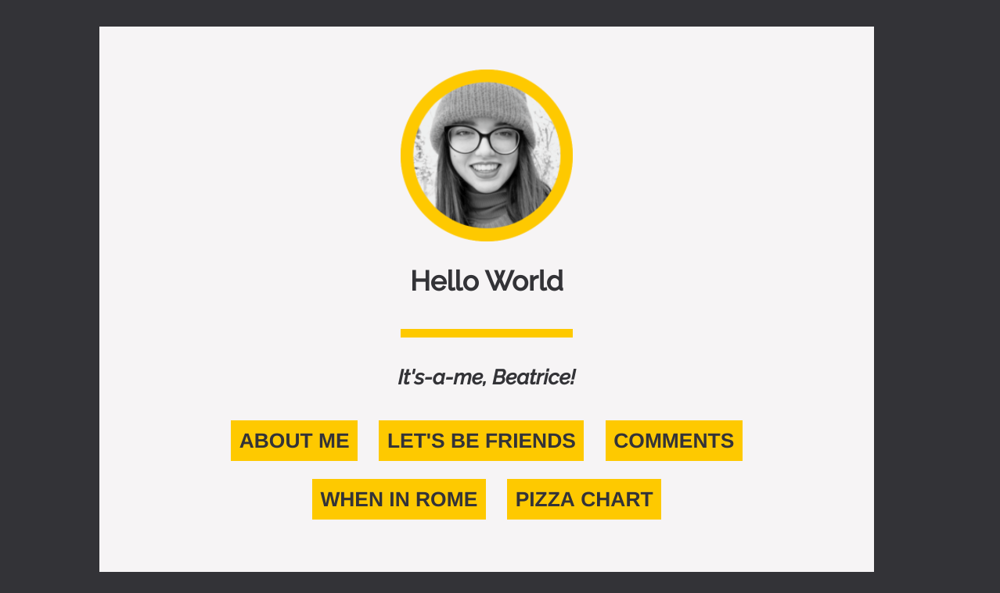
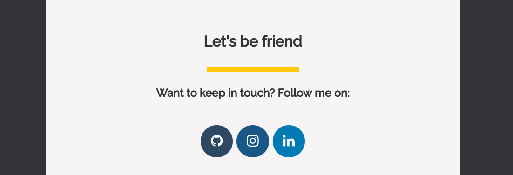

# Google Student Training in Engineering Program

Welcome! It's Beatrice, a Google STEP Intern 2020. 
 
This repo contains the projects I've worked on for the first half of my internship.
During the first 5 weeks of my internship I have learned a variety of web development tools, and put what I've learned into practice by developing my own personal portfolio. 

Check it out on: [Personal Portfolio | Beatrice](https://beatricemarch-step-2020.uc.r.appspot.com/)

This work is based on the [Google Software Product Sprint](https://g.co/softwareproductsprint) program.

Enjoy :)

# My portfolio

